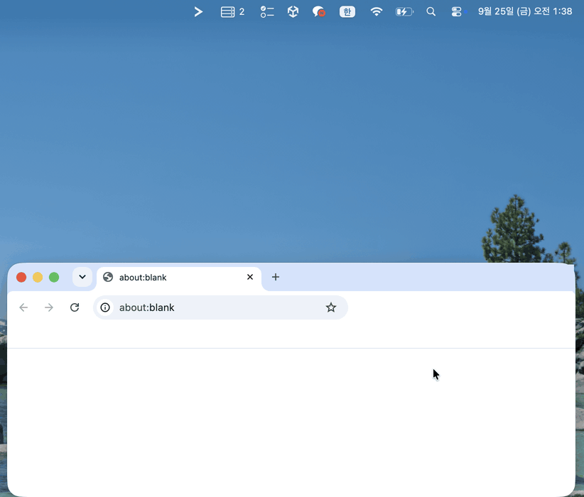
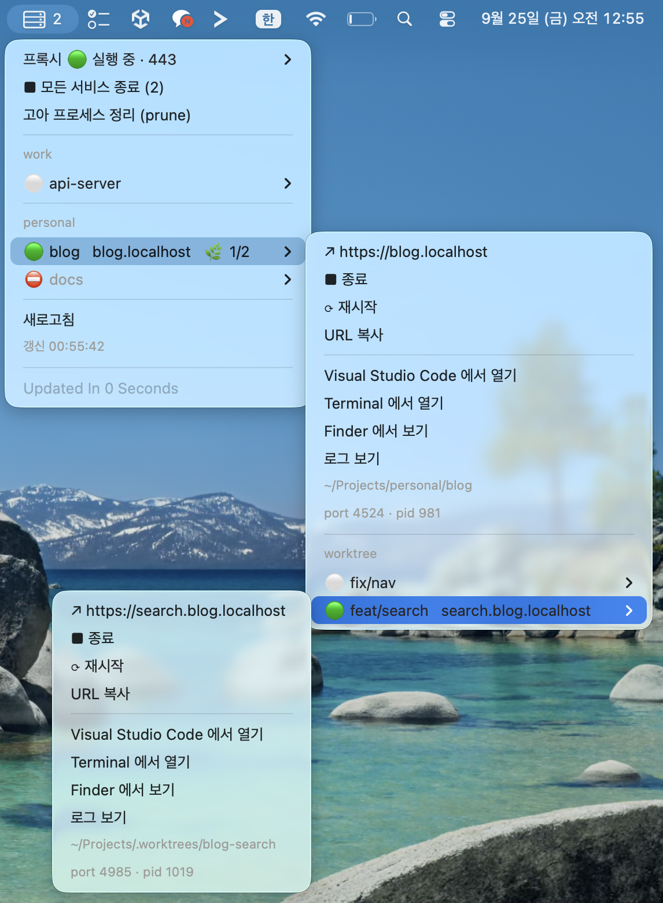

# portless-manager

[English](README.md) | **한국어**

[portless](https://github.com/vercel-labs/portless) 개발 서버를 위한 macOS 메뉴바.
내 장비의 portless 프로젝트를 폴더별로 모아 보고, 클릭 한 번으로 실행·종료·페이지 열기를 합니다.

<p align="center">
  
</p>

## 기능

- **자동 탐색.** 10초마다 프로젝트 폴더를 다시 훑습니다. 새 프로젝트, 이름 변경, git worktree
  추가·삭제가 플러그인을 건드리지 않아도 반영됩니다.
- **worktree 는 프로젝트 밑에.** worktree 마다 상태와 동작이 따로 있고, 호스트명은 portless 가
  붙이는 것과 같은 `<브랜치>.<이름>.localhost` 입니다.
- **상태는 portless 에서 직접.** `~/.portless/routes.json` 을 읽으므로 터미널에서 띄운 서비스도 잡힙니다.
- **실행·종료·재시작.** 실행은 메뉴바와 분리해서 띄우고, 종료는 프로세스 트리 전체를 끝내서
  `next dev` 가 포트를 쥔 채 남지 않게 합니다.
- **클릭되는 알림.** 서비스가 실제로 요청을 받을 수 있게 되면 알림이 오고, 클릭하면 그 페이지가 열립니다.
  시작에 실패하면 알림이 메뉴의 **로그 보기**를 안내합니다.
- **바로가기.** 페이지 열기, URL 복사, 에디터·터미널·Finder 에서 폴더 열기, 서비스 로그 보기.
- **다국어.** 영어·한국어를 지원하고 macOS 언어 설정을 따릅니다. 언어 추가는 JSON 파일 하나면 됩니다.
- **프록시 관리.** 프록시 시작·정지, `portless doctor`, `portless prune`, 부팅 시 자동 시작 설치.

## 요구 사항

- macOS 와 [SwiftBar](https://github.com/swiftbar/SwiftBar)
- 전역 설치한 [portless](https://github.com/vercel-labs/portless) (`npm i -g portless`, Node.js 24+ 필요)
- Python 3.10+ (표준 라이브러리만 사용해서 설치할 패키지가 없습니다)

portless 0.15.5, SwiftBar 2.1.1 에서 확인했습니다.

## 설치

```sh
git clone https://github.com/SiyeolBaek/portless-manager.git
cd portless-manager
python3 -m portless_manager install
```

SwiftBar 플러그인 폴더에 `portless-manager.10s.sh` 가 생깁니다. 플러그인은 이 저장소를 실행하는
얇은 래퍼라 업데이트는 `git pull` 이면 됩니다. 저장소를 다른 곳으로 옮겼을 때만 `install` 을
다시 실행하세요.

### 프록시를 먼저 띄우세요

portless 는 443 포트를 쓰고, 여기에는 `sudo` 가 필요합니다. SwiftBar 에는 비밀번호를 물을 터미널이
없어서, 메뉴의 **프록시 시작**은 터미널 창을 열어 실행합니다. 부팅할 때마다 하기 싫다면
**부팅 시 자동 시작**을 한 번 누르세요 (`portless service install` 을 실행합니다).

프록시가 꺼져 있는 동안에는 서비스 실행을 막아 둡니다. 띄워 봐야 곧바로 실패하기 때문입니다.

## 설정

프로젝트가 있는 위치를 `~/.config/portless-manager/config.json` 에 적습니다.

```json
{
  "roots": ["~/Documents/work", "~/Documents/personal"],
  "language": "auto"
}
```

- 각 루트의 **바로 아래 폴더**가 프로젝트 후보입니다. 메뉴에는 루트 폴더 이름으로 묶여 나옵니다.
- `portless.json` 이 있거나, `package.json` 의 의존성·스크립트에 `portless` 가 있으면 portless
  프로젝트로 봅니다.
- 설정 파일이 없으면 `~/Developer`, `~/Projects`, `~/Code`, `~/src`, `~/dev` 중 있는 곳을 훑습니다.
- `language` 는 선택입니다: `auto`(기본), `en`, `ko`, … [언어](#언어) 절을 보세요.
- 설정 경로는 `PORTLESS_MANAGER_CONFIG` 로 바꿀 수 있습니다. `PORTLESS_STATE_DIR` 은 portless 와
  같은 방식으로 따릅니다.

```sh
python3 -m portless_manager config   # 설정 경로와 실제로 훑는 루트
python3 -m portless_manager list     # 모든 프로젝트와 상태를 표로
```

## 언어

메뉴·알림·CLI 출력을 번역합니다. 지원 언어: **English** (`en`), **한국어** (`ko`).

언어는 아래 순서로 정합니다.

1. 환경변수 `PORTLESS_MANAGER_LANG`
2. `config.json` 의 `"language"`
3. macOS 선호 언어 (`defaults read -g AppleLanguages`)
4. `LC_ALL` / `LANG`
5. 영어

지역 태그는 주 언어로 맞춥니다 (`ko-KR` → `ko`). 번역에 빠진 문구는 영어로 나옵니다. SwiftBar 는
보통 플러그인에 `LANG` 을 넘겨주지 않기 때문에 macOS 설정을 먼저 봅니다. CLI 에서 한 번만 바꾸려면
`--lang` 을 쓰세요.

```sh
python3 -m portless_manager --lang en list
```

### 언어 추가하기

1. `portless_manager/locales/en.json` 을 `portless_manager/locales/<코드>.json` 으로 복사합니다
   (`ja`, `pt-BR` 같은 언어 코드).
2. 값을 번역합니다. 키와 `{자리표시자}` 는 그대로 둡니다. ▶ ■ ⟳ 같은 기호도 문구의 일부이니 남겨 둡니다.
3. `"_language"` 에 그 언어로 쓴 언어 이름을 적습니다.
4. `python3 -m unittest discover -s tests` 를 실행합니다. 키나 자리표시자가 빠지면 실패합니다.

새 언어 Pull Request 를 환영합니다.

## 상태 표시

<p align="center">
  
</p>

| 표시 | 뜻 |
|---|---|
| 🟢 | 실행 중. portless 에 살아 있는 route 가 있습니다 |
| ⏳ | 시작 중. 메뉴에서 띄웠고, 앱이 아직 연결을 받지 않습니다 |
| ⚠️ | 실패. route 를 등록하기 전에 프로세스가 끝났습니다. **로그**를 확인하세요 |
| ⚪ | 꺼짐 |
| ⛔ | 실행 불가. 실행할 스크립트가 없거나 모노레포 `apps` 설정입니다 |

## 동작 방식

| 동작 | 하는 일 |
|---|---|
| 상태 | 프로젝트마다 계산한 호스트명을 `~/.portless/routes.json` (`{hostname, port, pid}`) 의 살아 있는 항목과 맞춥니다. `portless list` 에 JSON 출력이 없어 파일을 직접 읽습니다 |
| 실행 | 프로젝트 폴더에서 인자 없는 `portless` 를 새 세션으로 띄워 SwiftBar 가 끝나도 살아 있게 합니다. 출력은 `~/Library/Logs/portless-manager/<이름>.log` 로 갑니다 |
| 준비 알림 | 분리된 감시 프로세스가 route 의 포트가 연결을 받을 때까지 최대 60초 기다립니다 (portless 는 앱이 뜨기 전에 route 를 등록합니다). 그 뒤 SwiftBar 알림(`swiftbar://notify`)을 보내고, 클릭하면 페이지가 열립니다. 그 전에 프로세스가 죽으면 클릭 동작 없는 실패 알림을 보냅니다. SwiftBar 는 알림에서 웹 링크만 열 수 있어서 로그 파일(`file://`) 링크는 동작하지 않기 때문입니다. 종료 등 다른 동작의 알림에도 클릭 동작이 없습니다. macOS 26 에서는 클릭할 때 SwiftBar 안내 창도 함께 뜹니다 ([한계](#한계) 참고) |
| 종료 | route 의 pid(portless CLI)에 SIGTERM 을 보내면 portless 가 앱을 끄고 route 를 지웁니다. 8초 뒤에도 살아 있으면 자식 프로세스 그룹까지 SIGKILL 합니다 |
| 모두 종료 | 설정한 루트 밖의 것까지 살아 있는 route 를 전부 끕니다 |

기동 기록은 `~/Library/Application Support/portless-manager/launch/` 에 남습니다. 메뉴는 이 기록으로
「시작 중」과 「실패」를 구분합니다.

## 한계

- **이름 규칙은 portless 를 옮겨 온 것입니다.** 호스트명은 portless 0.15.5 의 `inferProjectName` ·
  `detectWorktreePrefix` 를 따릅니다. 이후 버전에서 규칙이 바뀌면 실행 중인 서비스가 꺼짐으로
  보일 수 있습니다. 현재 규칙은 `tests/` 가 고정해 둡니다.
- **모노레포는 지원하지 않습니다.** `portless.json` 에 `apps` 가 있는 프로젝트는 목록에만 뜨고 실행하지 않습니다.
- **직접 붙인 이름은 매칭되지 않습니다.** `--name` 을 붙여 손으로 띄운 서비스는 계산한 호스트명과 다릅니다.
- **worktree 이름이 겹칠 수 있습니다.** `main`·`master` 브랜치 worktree 는 접두사가 없어 본 체크아웃과
  호스트명이 같습니다. 메뉴에 표시해 둡니다.
- **알림을 클릭하면 SwiftBar 안내 창이 뜹니다 (macOS 26).** SwiftBar 2.1.1 은 플러그인 알림을 클릭할 때마다
  「SwiftBar is already running」 창을 띄웁니다. 페이지는 그대로 열리니 창만 닫으면 됩니다. SwiftBar 쪽 버그
  ([swiftbar/SwiftBar#535](https://github.com/swiftbar/SwiftBar/issues/535))라서 고쳐지면 이쪽은 바꿀 것이 없습니다.

## 개발

사용자에게 보이는 문구는 전부 `portless_manager/locales/` 에 있습니다. 코드는 키(`_("target.start")`)만
쓰고, 패키지 코드에 한글이 들어가면(주석 포함) 테스트가 실패합니다.

```sh
python3 -m unittest discover -s tests
python3 -m portless_manager render --wrapper /dev/null   # SwiftBar 원본 출력 보기
```

## 라이선스

[MIT](LICENSE) © Siyeol Baek
